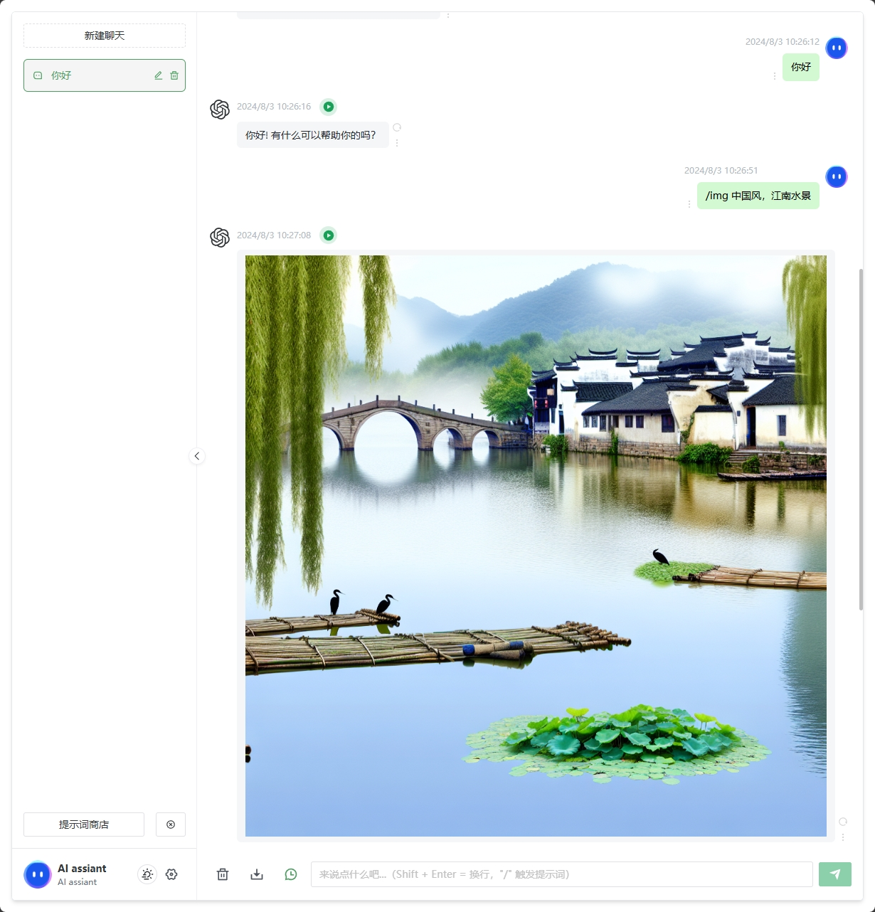
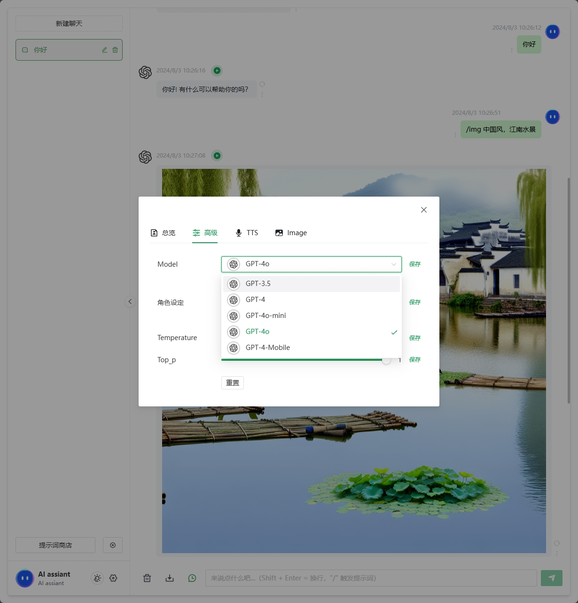
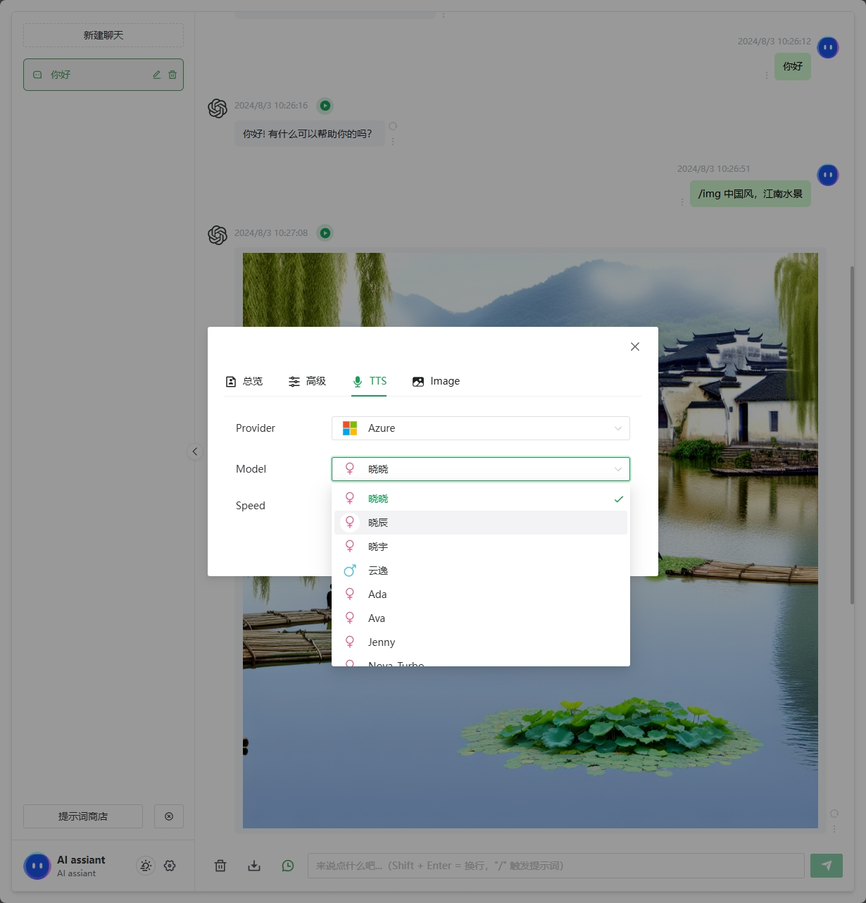

# chatgptweb

Base [Chanzhaoyu-chatgpt-web](https://github.com/Chanzhaoyu/chatgpt-web)

Add TTS & Images generations
添加了语音合成（azure&openai）以及图片生成（openai dall-e）





service环境变量说明：
```env
# OpenAI API Key - https://platform.openai.com/overview
OPENAI_API_KEY=
# chatApi key（可选），如为空则默认使用OPENAI_API_KEY
OPENAI_CHAT_KEY=
# change this to an `accessToken` extracted from the ChatGPT site's `https://chat.openai.com/api/auth/session` response
OPENAI_ACCESS_TOKEN=

# OpenAI API Base URL - https://api.openai.com
OPENAI_API_BASE_URL=
# 
# # OpenAI API Model - https://platform.openai.com/docs/models
# OPENAI_API_MODEL=gpt-4o-mini-2024-07-18

# set `true` to disable OpenAI API debug log
OPENAI_API_DISABLE_DEBUG=

# Reverse Proxy - Available on accessToken
# Default: https://ai.fakeopen.com/api/conversation
# More: https://github.com/transitive-bullshit/chatgpt-api#reverse-proxy
API_REVERSE_PROXY=

# timeout
TIMEOUT_MS=100000

# Rate Limit
MAX_REQUEST_PER_HOUR=

# Secret key
AUTH_SECRET_KEY=

# Socks Proxy Host
SOCKS_PROXY_HOST=

# Socks Proxy Port
SOCKS_PROXY_PORT=

# Socks Proxy Username
SOCKS_PROXY_USERNAME=

# Socks Proxy Password
SOCKS_PROXY_PASSWORD=

# HTTPS PROXY
HTTPS_PROXY=

# TTS azure 
AZURE_TTS_KEY=
AZURE_TTS_REGION=southeastasia
```

doc [README-ZH](./README.zh.md)